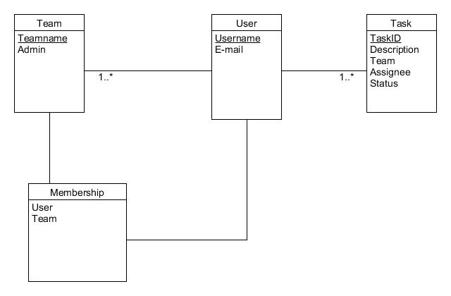

# Kanban tábla

## Bevezetés

### 1. Rövid leírás

Ez az alkalmazás egy virtuális Kanban táblát valósít meg, mely segítségével nyomon követhetjük a különböző munkahelyi feladatok életciklusát. (További információ: https://en.wikipedia.org/wiki/Kanban_board) 

### 2. Adatbázis modell

### 3. Funkcionális követelmények

* A felhasználó regisztrálhat, csatlakozhat csapatokhoz és létre is hozhat csapatot.
* Minden csapatnak egy táblája van és ezen jelennek a feladatok.
* Minden táblának létezik egy adminja, aki új feladatokat vehet fel a táblán és bárkit hozzárendelhet új feladatokhoz.
* Minden táblán léteznek  oszlopok: az elvégzendő feladatoknak egy, a haladó feladatoknak egy, a megrekedt feladatoknak egy és az elvégzett feladatoknak egy.
* A felhasználó egy csapat tábláján új feladatokat rendelhet magához, és azokat mozgathatja az oszlopok között.
* Minden feladatnak van leírása, minden feladat csak egy oszlopban lehet egyszerre.

## Szerver

### REST API
* GET /auth/login - bejelentkező felület megtekintése (template: login.html)
* POST /auth/login - bejelentkezés, felhasználónév és jelszó megadásával
* GET /auth/register - regisztráló felület megtekintése (template: register.html)
Az alábbi hívások csak bejelentkezés után használhatóak:
* GET /team/ - visszaadja a csapatok listáját
* GET /team/{ÉRVÉNYES_CSAPAT_AZONOSÍTÓ} - visszaadja a csapatot objektumként
* POST /team/ - új csapat létrehozása, név megadásával
* GET /task/{ÉRVÉNYES_FELADAT_AZONOSÍTÓ} - azonosító alapján visszaadja a feladatot objektumként
* GET /task/list/{ÉRVÉNYES_CSAPAT_AZONOSÍTÓ} - feladatok listázása csapatonként
* POST /task/list/{ÉRVÉNYES_CSAPAT_AZONOSÍTÓ} - feladat hozzáadása
* GET /task/progress//{ÉRVÉNYES_FELADAT_AZONOSÍTÓ}?progress={FELADAT_HELYE} - a megfelelő azonosítójú feladatot BACKLOG/IN_PROGRESS/TEST/BLOCKED/DONE állapothoz rendeljük

## Kliens

### CLIENT APP
* /register - a regisztrációs mezők (username, email, password) kitöltésével regisztrálhatunk rendszerbe.
* /login - regisztrált felhasználó beléphet a rendszerbe
* /teams - a felhasználó, szerepkörétől függően megtekintheti a csapatokat és újat is létrehozhat
* /team/?teamid - a felhasználó, a választott csapathoz tartozó feladatok állapotát módosíthatja és új feladatokat vehet fel
* /team/?teamid/task/?taskid - a felhasználó az adott feladathoz tartozó leírásokat szerkesztheti
